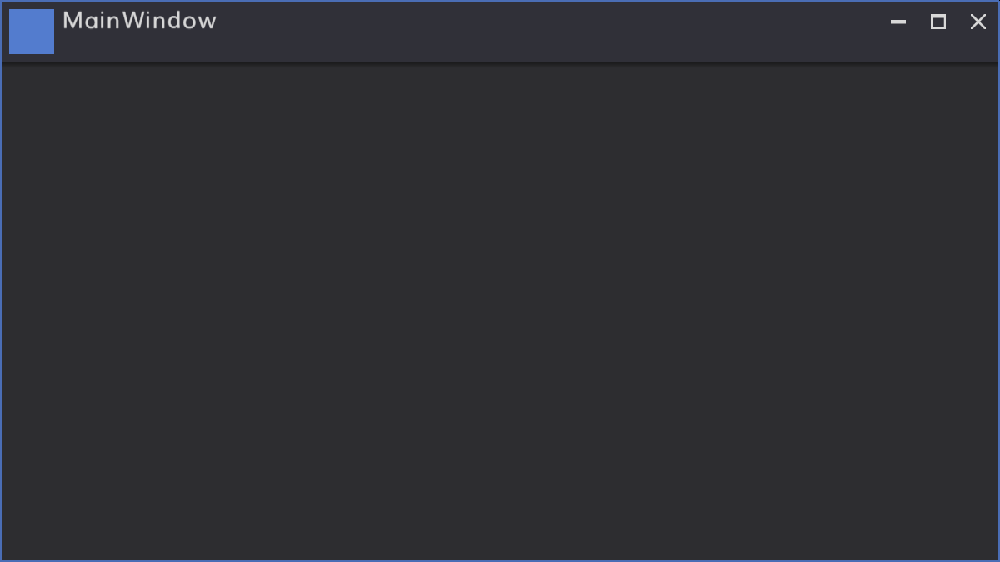

# Biaui

WPF dark theme and controls for .NET Core 3.1.


## Feature

* Dark color
* Per Monitor DPI aware
* Some specialized controls
    * Node editor
    * Number editor
    * Color picker
    * Multiple selectable treeview
    * and more...
* Some lightweight standard controls
    * Reimplementation. about x20-30 faster than standard WPF controls


## Quick Start

### Step1. Create Project and Add Biaui
```
> dotnet new wpf -o first-biaui
> cd first-biaui
> dotnet add package biaui
```


### Step2. Add Biaui's resources

- Open App.xaml
    - Add ```<ResourceDictionary Source="pack://application:,,,/Biaui;component/Styles.xaml" />```

```xml
<Application x:Class="first_biaui.App"
             xmlns="http://schemas.microsoft.com/winfx/2006/xaml/presentation"
             xmlns:x="http://schemas.microsoft.com/winfx/2006/xaml"
             xmlns:local="clr-namespace:first_biaui"
             StartupUri="MainWindow.xaml">
    <Application.Resources>
        <ResourceDictionary Source="pack://application:,,,/Biaui;component/Styles.xaml" />
    </Application.Resources>
</Application>
```

### Step3. Use Biaui's Window

- Open MainWindow.xaml
    - Add ```xmlns:controls="clr-namespace:Biaui.Controls;assembly=Biaui"```
    - Change ```<Window``` to ```<controls:BiaWindow```
    - Change ```</Window>``` to ```</controls:BiaWindow>```

```xml
<controls:BiaWindow x:Class="first_biaui.MainWindow"
        xmlns="http://schemas.microsoft.com/winfx/2006/xaml/presentation"
        xmlns:x="http://schemas.microsoft.com/winfx/2006/xaml"
        xmlns:d="http://schemas.microsoft.com/expression/blend/2008"
        xmlns:mc="http://schemas.openxmlformats.org/markup-compatibility/2006"
        xmlns:controls="clr-namespace:Biaui.Controls;assembly=Biaui"
        xmlns:local="clr-namespace:first_biaui"
        mc:Ignorable="d"
        Title="MainWindow" Height="450" Width="800">
    <Grid>

    </Grid>
</controls:BiaWindow>
```

- Open MainWindow.xaml.cs
    - Remove ```: Window```

```C#
using System;
using System.Collections.Generic;
using System.Linq;
using System.Text;
using System.Threading.Tasks;
using System.Windows;
using System.Windows.Controls;
using System.Windows.Data;
using System.Windows.Documents;
using System.Windows.Input;
using System.Windows.Media;
using System.Windows.Media.Imaging;
using System.Windows.Navigation;
using System.Windows.Shapes;

namespace first_biaui
{
    /// <summary>
    /// Interaction logic for MainWindow.xaml
    /// </summary>
    public partial class MainWindow
    {
        public MainWindow()
        {
            InitializeComponent();
        }
    }
}
```

### Step4. Build and Run
```
> dotnet run
```



## Reference External Assets

* Jewelry
    * https://github.com/YoshihiroIto/Jewelry
    * MIT License


## Including External Assets

* WPF
    * https://github.com/dotnet/wpf
    * MIT License

* Material Design icons by Google
    * https://github.com/google/material-design-icons
    * Apache License 2.0

* Muli
    * https://fonts.google.com/specimen/Muli
    * SIL OPEN FONT LICENSE 1.1

* Genshin Gothic
    * http://jikasei.me/font/genshin
    * SIL OPEN FONT LICENSE 1.1

## Including External Assets (Biaui.Extension)

* WPF Control for Direct2D with SharpDX
    * https://github.com/YoshihiroIto/D2dControl
    * MIT License

* SharpDX
    * https://github.com/sharpdx/SharpDX
    * MIT License


## Author

Yoshihiro Ito  
Twitter: [https://twitter.com/yoiyoi322](https://twitter.com/yoiyoi322)  
Email: yo.i.jewelry.bab@gmail.com  


## License

MIT

